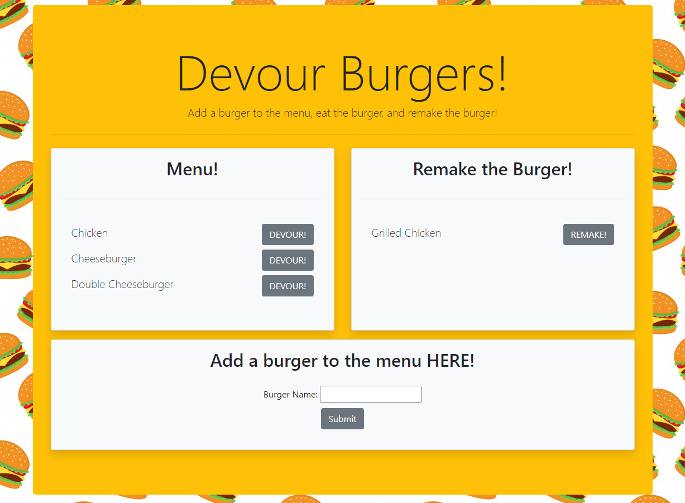

# Eat the Burger
Deployed App: https://tranquil-lowlands-26889.herokuapp.com/

## Table of contents
* [Description](#description)
* [Installation](#installation)
* [Screenshot](#screenshot)
* [Questions](#questions)

## Description
Simple application using node express, mysql, ORM and handlebars. The user is able to add a burger to the database and the burger displays on the webpage in a "Menu!" list. The user is given an option to "DEVOUR" the burger which then moves it to the other side of the webpage in a new list. The user also has the option to "Remake the Burger" which places the burger back on the menu. There is no delete option so once the user adds a burger to the database, it will always be an option.
        
## Installation
To install necessary dependencies, run the following command:
```
npm i
```

## Screenshot


## Questions
If you have any questions about this repository, open an issue or contact me directly at megtej@gmail.com. You can find more of my work at [mslee001](https://github.com/mslee001).